Report
======

Abstract
--------

Maximising the economic effectiveness of a wind farm is essential in
making wind a more economic source of energy. This effectiveness can be
increased through the reduction of operation and maintenance costs,
which can be achieved through continuously monitoring the condition of
wind turbines. An alternative to expensive condition monitoring systems,
which can be uneconomical especially for older wind turbines, is to
implement classification algorithms on supervisory control and data
acquisition (SCADA) signals, which are collected in most wind turbines.

Several publications were reviewed, which were all found to use separate
algorithms to predict specific faults in advance. In reality, wind
turbines tend to have multiple faults which may happen simultaneously
and have correlations with one another.

This project focusses on developing a methodology to predict multiple
wind turbine faults in advance simultaneously by implementing
classification algorithms on SCADA signals for a wind farm with 25
turbines rated at 2,500 kW, spanning a period of 30 months. The data,
which included measurements of wind speed, active power and pitch angle,
was labelled using corresponding downtime data to detect normal
behaviour, faults and varying timescales before a fault occurs.

Three different classification algorithms, namely decision trees, random
forests and k nearest neighbours were tested using imbalanced and
balanced training data, initially to optimise a number of
hyperparameters. The random forest classifier produced the best results.

Upon conducting a more detailed analysis on the performance of specific
faults, it was found that the classifier was unable to detect the
varying timescales before a fault with accuracy comparable to that of
normal or faulty behaviour. This could have been due to the SCADA data,
which are used as features, being unsuitable for detecting the faults,
and there is potential to improve this by balancing only these classes.

**Keywords:** wind turbine, classification algorithm, SCADA, fault
detection, condition monitoring

Introduction
------------

Background
~~~~~~~~~~

There is a need to increase the economic effectiveness of wind turbines,
which refers to the cost to run them relative to the electricity
generation, or revenue [1]_  [2]_. Increasing this effectiveness lowers
the payback period of new wind turbines or farms, thus making wind a
more economic clean energy source, attracting governments and private
organisations to make more investments in wind projects [1]_. It can,
however, be decreased due to major component failure, frequent downtime,
turbine degradation and age, which in turn increase the operation and
maintenance cost and decrease the energy generation efficiency of wind
turbines [1]_  [3]_. There are difficulties and high costs involved in
carrying out maintenance on wind turbines, especially for ones that
operate in extreme and remote conditions, such as offshore wind farms,
where the turbines tend to also exist in larger numbers [3]_  [4]_.

Condition-based monitoring systems that continuously monitor wind
turbine states increase this effectiveness by significantly reducing the
maintenance costs, reportedly by 20 % to 25 %, as it prevents
unscheduled maintenance [2]_. According to the Electric Power Research
Institute, reactive maintenance, which refers to running the turbine
until it reaches failure, has the highest cost, followed by preventive
or scheduled maintenance, which is reported to cost 24 % less [5]_.
Meanwhile, condition-based or predictive maintenance, which prevents
catastrophic failure, [1]_ is reported to save 47 % of the cost of
reactive maintenance, [5]_ which makes it the most cost-effective and
preferred approach. Condition-based monitoring technologies include
sensor-based oil and vibration analysis, which are useful for checking
the oil for properties such as temperature, and rotating equipment
respectively [6]_. These technologies, however, tend to put emphasis on
the more expensive parts of a wind turbine such as the gearbox [7]_ due
to the high costs involved in the installation of these sensors [2]_  [6]_.
These systems, which can be purchased from the turbine
manufacturer, are usually pre-installed in offshore wind turbines due to
the harsh environments in which they operate. However, they can be
expensive [4]_ and uneconomical, especially for older wind turbines in
onshore wind farms, whose outputs are often less than that of an
offshore wind farm.

An alternative would be to use SCADA-based analysis, where the only cost
involved would be computational and expensive sensors are not
required [2]_  [4]_. A SCADA system, which stands for supervisory
control and data acquisition, found pre-installed in most utility-scale
wind turbines, collects data using numerous sensors at the controllers
with usually 10-minute resolution [4]_  [8]_, of various parameters of
the wind turbine, such as wind speed, active power, bearing temperature
and voltage [2]_. Power curve analysis can be done using this data, but
this analysis only detects wind turbine underperformance [9]_.
Meanwhile, implementing machine learning algorithms on SCADA signals to
classify them as having either normal or anomalous behaviour, has the
ability to predict faults in advance. This has been demonstrated in a
number of publications.

Kusiak and Li [10]_ investigated predicting a specific fault, which is
diverter malfunction. 3 months’ worth of SCADA data of four wind
turbines were used and the corresponding status and fault codes were
integrated into this data to be labelled to differentiate between normal
and fault points. To prevent bias in prediction in machine learning, the
labelled data is sampled at random, ensuring the number of samples with
a fault code is comparable to the number of normal samples. Four
classification algorithms, namely neural networks, boosting tree,
support vector machines, and classification and regression trees were
trained using two-thirds of this data which was randomly selected. The
boosting tree, which was found to have the highest accuracy of 70 % for
predicting specific faults, was investigated further. The accuracy of
predicting a specific fault at the time of fault was 70 %, which
decreased to 49 % for predicting it 1 hour in advance. Only one specific
fault was the focus of this methodology and in reality, wind turbines
could have many faults in different components and structures, which may
all have some form of correlation between one other.

Godwin and Matthews [7]_ focussed on wind turbine pitch control faults
using a classifier called the RIPPER algorithm. They used 28 months’
worth of SCADA data containing wind speeds, pitch motor torques and
pitch angles, of eight wind turbines known to have had pitch problems in
the past. The classes used were normal, potential fault and recognised
fault. Using maintenance logs, data up to 48 hours in advance was
classed as recognised fault, data in advance of this with corresponding
SCADA alarm logs indicating pitch problems was classed as potential
fault, and the remaining unclassified data was classed as normal. Random
sampling was performed here as well to balance the classes and prevent
bias. The data of four turbines were used to train the RIPPER algorithm,
and the remaining four used for testing. The analysis was done using the
entire 28 months of data as well as 24, 20, 16, 12, 8 and 4 months of
data to find out how the amount of data affects the accuracy of
classification. Using the entire 28 months of data was found to produce
the most accurate classifier, with a mean accuracy of 85 %. Looking at
the results in more depth, it was found that the classifier had F1
scores, which is an accuracy measure that accounts for true and false
positives and negatives, of 79 %, 100 % and 78 % in classifying normal,
potential fault and recognised fault data respectively. Although the
results are an improvement to Kusiak and Li [10]_, this methodology
similarly focussed on only one fault.

Leahy et al. [2]_ used a specific fault prediction approach,
implementing a support vector machine classifier from scikit-learn’s
LibSVM. They used SCADA data from a single 3 MW wind turbine spanning 11
months with status and warning codes. The labelling was done such that
data with codes corresponding to the turbine in operation, low and storm
wind speeds represent normal conditions and codes corresponding to each
specific fault to represent faulty conditions. Data preceding these
fault points by 10 minutes and 60 minutes were also labelled as faults
in separate sets and the effects of using these different time scales to
predict faults were investigated. For data identified as normal, filters
were applied to remove curtailment and anomalous points. The
classifier’s hyperparameters were optimised using randomised grid search
and validated using ten-fold cross-validation, and the classes were
balanced using class weights. Separate binary classifiers were trained
to detect each specific type of fault, which were faults in air cooling,
excitation, generator heating, feeding and mains failure. The prediction
of generator heating faults 10 minutes in advance had the best results,
with F1 scores of 71 % and 100 % using balanced and imbalanced training
data respectively. This increase in score using imbalanced data was
attributed to the test set having very few instances with the fault
class relative to normal data. The same fault, when predicted 60 minutes
in advance, had F1 scores of 17 % and 100 % using imbalanced and
balanced training data respectively. Although the score is perfect and
it demonstrates the effects of using balanced datasets, the
classification again is done separately for each specific fault and it
performed poorly on other faults. For instance, detecting excitation
faults 10 and 60 minutes in advance using balanced training data only
yielded F1 scores of 8 % and 27 % respectively.

This project will therefore focus on integrating the ability to predict
multiple faults at different time scales simultaneously.

Objectives
~~~~~~~~~~

The first objective of this project is to implement a classification
algorithm on wind turbine SCADA signals to identify underperforming
turbines. This involves setting-up the machine learning environment,
processing operational data and reporting initial results obtained
through implementing a classification algorithm on the data.

The second objective is to create an effective methodology for the
integration of failures and to present and interpret results. This
includes labelling the data such that each specific fault can be
differentiated, evaluating the performances of several classification
algorithms to find the most suitable classifier, identifying limitations
and suggesting improvements to the method and how it can be adapted for
use in industry.

Methodology
-----------

Tools and datasets
~~~~~~~~~~~~~~~~~~

This project requires a computer with Python Programming Language [11]_
and essential libraries installed for data processing. The computer used
has a dual core processor with 2.8 GHz maximum clock speed and 4 GB RAM.
Additionally, the open-source scikit-learn library [12]_ is used for
machine learning. The datasets used are that of a wind farm comprised of
25 turbines with a rated power of 2,500 kW covering a period of 30
months starting 1st November 2014, downloaded from Natural Power’s
database in CSV format. The first dataset is wind turbine SCADA signals
timestamped with a resolution of 10 minutes, with a total file size of
452 MB, and the other dataset is corresponding downtime data for the
same period, with a total file size of 4 MB. In the interests of Natural
Power, the location of the wind farm and turbine model will not be
disclosed in this report.

Data processing
~~~~~~~~~~~~~~~

The SCADA data has 17 fields, summarised in Table 1. Fields highlighted
in green are average measurements recorded over each 10-minute period.
Since these highlighted fields are properties of the turbines or
describe its performance, they can be used as features in machine
learning. Each turbine has two nacelle anemometers and wind vanes; one
is used to control the turbine, and the other to monitor the first. The
measurements from the anemometer and wind vane used to control the
turbine are recorded again as ``ws_av`` and ``wd_av``, with the latter
taking into account the nacelle position. Using only ``ws_av`` and
``wd_av`` for wind speed and wind direction, the number of features that
are available for machine learning is 10.

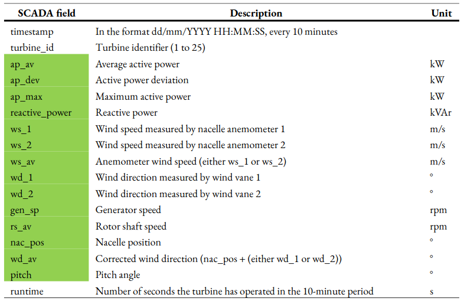

   **Table 1:** Summary of SCADA fields
   for the SCADA data used in this project. The fields include timestamps
   with a resolution of 10 minutes, average active power, wind speed, pitch
   and runtime. The fields that contain measurements averaged over the
   10-minute period are highlighted in green. These measurements can be
   used as features in machine learning as they are turbine properties.

The downtime data consists of fields summarised in Table 2. Each row of
downtime data consists of the start and end timestamps of the downtime
event, downtime categories, workorders and alarms. Downtime categories,
which are turbine, environmental, grid, infrastructure and availability
categories, describes the turbine’s condition or cause of downtime when
the maintenance work was undertaken. Each condition within each downtime
category is represented by a unique identifier in the dataset. A
separate spreadsheet accompanying the dataset list what each identifier
stands for. All quantities in the downtime data, except the alarms, are
supervised (i.e. the data recordings are input and monitored by
maintenance professionals).

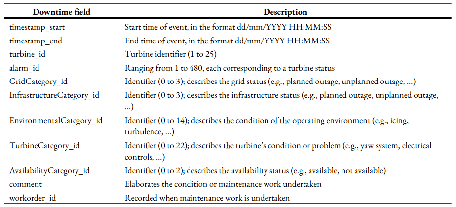

   **Table 2:** Summary of fields for the
   downtime data used in this project. The fields include start and end
   timestamps for the downtime event, downtime categories, workorders and
   alarms.

Each row of SCADA data requires a class which describes the state of the
turbine. The chosen classes are ‘normal’ for normal behaviour, and
‘faulty’ to signify a fault. As the aim is to predict faults in advance,
a category of classes, called ‘before fault’ will also be used. To
automate the labelling process, the SCADA data can be merged with the
downtime data, which has turbine categories, listed in Table 3, that can
be used to label faults. Some of these turbine categories, such as ‘OK’
and ‘scheduled maintenance’, do not indicate a fault in the turbine, and
‘other’ does not specify the condition. Therefore, only the turbine
categories which indicate faults, highlighted in green, are used to
class the SCADA data. Prior to merging the two datasets, the downtime
data is restructured such that it has the same 10-minute resolution as
the SCADA data. The SCADA data was also found to have missing rows of
data. Empty data rows with only the timestamp corresponding to the
missing rows were added to rectify this. Once they are merged, 14
separate labels, or columns, are added for each specific fault, which
will allow for the different faults to be distinguished. The rows with a
fault category are classed as ‘faulty’ in the corresponding column.

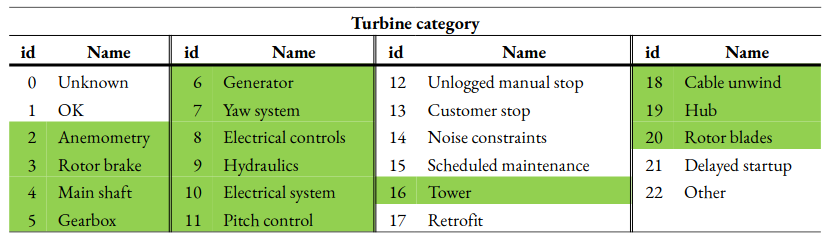

   **Table 3:** List of turbine
   categories in the wind farm downtime data. The categories used as the
   different faults for labelling are highlighted in green. The others do
   not indicate a fault.

To summarise the machine learning terminology used, features refer to
SCADA fields which are turbine properties, labels refer to turbine
categories or type of fault, and classes refer to the state of the
turbine (e.g. ‘normal’ or ‘faulty’) for each row of data at each label.
The features and labels will be fit to a classifier for training as
arrays *X* of size ``[rows, 10]`` and Y of size ``[rows, 14]``
respectively, where rows refer to the number of rows in the training
data.

To predict faults for each label, rows with timestamps up to 48 hours in
advance of a ‘faulty’ row are classed at 6-hour intervals (i.e. up to
*X* hours before a fault, where *X* = 6, 12, ..., 48). The reasons for
having classes of 6-hour intervals for fault detection rather than a
single class is to allow action to be taken appropriate to the time
before fault. For example, if it is predicted that the wind turbine
could have a fault in six hours or less, it could be switched off to
prevent further damage from occurring. 48 hours is enough time for
maintenance professionals to travel to site and carry out inspection,
and decide on what action to take. Depending on the nature of the site,
this value can be modified (i.e. for an offshore wind farm which
operates in harsh environments, it is more likely to take a longer time
to travel to the site and complete works relative to an onshore wind
farm).

Power curves are used to help with labelling as they are easier to
visualise due to the distinct power curve shape which represents wind
turbine performance. Figure 1a shows the labelled power curve for
turbine 2 with turbine category 16, where many curtailment and anomalous
points are classed as ‘normal’. These should be removed as they deviate
from the typical power curve shape which indicates normal behaviour. To
filter out the curtailment, the pitch angle should be within a typical
threshold for ‘normal’ data points between 10 % and 90 % power. Data
points with power below 10 % and above 90 % are not included, pitch
angles often deviate from 0 ° in these operating regions, due to the
control of the turbine. To find this threshold, the most frequent pitch
angles are quantified, with 0 ° being the most frequent. Filtering out
points with a pitch angle exceeding 0 °, however, distorts the power
curve shape, removing a large portion of points in the region where it
transitions to rated power. To prevent this, pitch angles between 0 °
and 10 ° were tested as the threshold, with 3.5 ° producing the best
result (see Appendix 1 for full results). The effects of applying this
filter can be seen in Figure 1b, which still has anomalous points below
10 % and above 90 % power. To remove these, additional filters are
applied to ‘normal’ data points at operating wind speeds, including
removing zero power, and turbine categories and other downtime
categories that are not faults or ‘OK’, and runtime of less than 600 s.
There is a vertical line of data points at zero wind speed which is
removed using a power threshold of 100 kW before the cut-in speed of 3
m/s. It is necessary to use this threshold because the nacelle
anemometer wind speed, which is used to plot these power curves, is not
an accurate measure of the wind speed incident on the turbine blades,
and removing all data points exceeding 0 kW power before cut-in results
in a distorted power curve shape (see Appendix 2). The threshold is
based on the minimum power before cut-in that does not distort the power
curve shape for all 25 turbines. The result of applying these filters is
shown in Figure 1c.

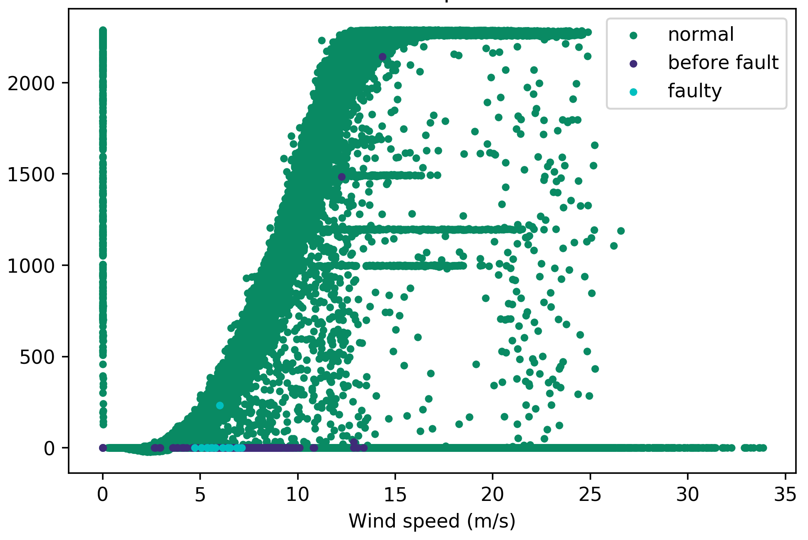

   **Figure 1:** Changes to the power
   curve of turbine 2 with the fault points corresponding to when the
   turbine category is 16 (‘tower’) through the two stages of filtering out
   anomalous and curtailment points labelled as ‘normal’. The original
   power curve, with all data points, is shown in **Figure 1a**.

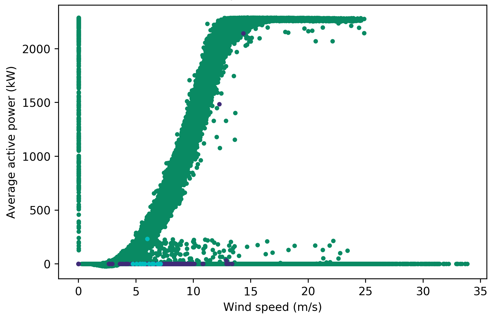

   The first
   stage involves a filter based on a pitch angle threshold, which produces
   **Figure 1b**, displaying ‘normal’ data points with pitch angles between
   0 ° and 3.5 ° and between 10 % power and 90 % power (i.e. without
   curtailment).

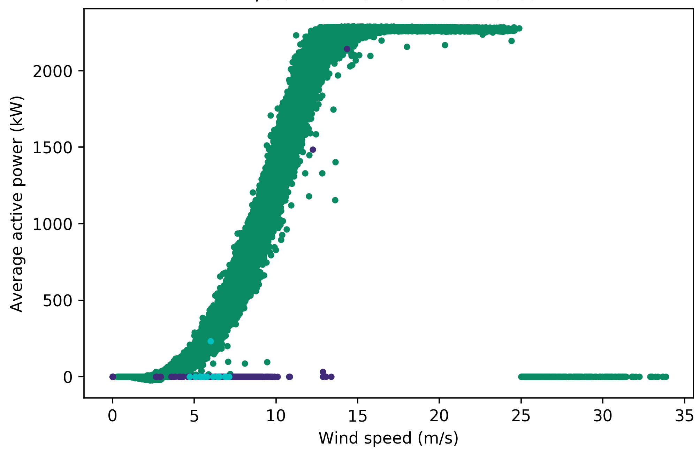

   The second stage involves several additional filters
   applied to ‘normal’ data points to produce the final power curve
   **Figure 1c**. These filters are either power > 100 kW before cut-in (3
   m/s), or one of the following at operating wind speeds (3 m/s to 25
   m/s): (i) power ≤ 0 kW, (ii) runtime < 600 s, (iii) availability
   categories ≠ available / non-penalising, (iv) environmental, grid or
   infrastructure categories ≠ OK, (v) turbine categories not highlighted
   in Table 3, or ≠ OK.

Rows of data with missing features and labels are removed, as all fields
must be complete for classification. Instead of deleting the rows of
data corresponding to the data points removed from the ‘normal’ class,
they are classed as ‘curtailment’. This is because the data points
removed are specific to one label, which means they are not necessarily
classed as ‘normal’ for other labels, and it is important for the
classifier to learn the different states of the turbine for each fault.
To summarise, the classes used are ‘normal’, ‘faulty’, ‘curtailment’ and
‘up to *X* hours before fault’ (where *X* = 6, 12, …, 48).

Classification
~~~~~~~~~~~~~~

Since there are numerous classifiers offered in scikit-learn, this is
narrowed down to a manageable number for comparison. As explained above,
each row of SCADA data, or sample, has multiple labels that require
classification into multiple classes, which makes this a
multiclass-multilabel problem. There are presently three classification
algorithms on scikit-learn with the ability to classify
multiclass-multilabel problems, namely decision trees (DT), random
forests (RF) and k nearest neighbours (kNN) [13]_. Therefore, only these
three classifiers are evaluated in this project.

DT is a simple technique which uses a tree structure to ask a series of
questions with conditions to split data with different attributes [14]_.
While DT only uses a single tree, RF constructs multiple trees which
perform the classification to determine the class, with the majority
class among all trees being selected, therefore producing a classifier
better than DT [15]_. Meanwhile, for kNN, the class of a test sample is
determined by comparing the sample to a number of closest neighbouring
training samples [16]_  [17]_. Each classifier consists of
hyperparameters which can be optimised for specific data for better
performance. An example is the number of neighbours, or *k*, for kNN,
which is a user-defined positive integer.

The data used in this project is highly imbalanced (i.e. the number of
samples for ‘normal’ class is in thousands for each turbine, while the
‘faulty’ and ‘*X* hours before fault’ classes only range from tens to a
few hundreds). This can cause the classifier to be biased towards the
majority class and perform poorly on minority classes [18]_. The effect
of balancing data is investigated by doing classification with and
without class balancing. The balancing is done by oversampling all
classes using the imbalanced-learn library’s random over sampler [19]_
prior to feeding the training data into the classifiers. Oversampling is
done instead of random sampling, because it will not reduce the amount
of data, which causes loss of information. This oversampling does not
support multilabel classification (i.e. it only accepts array *Y* of
size ``[rows, 1]``), therefore separate estimators will be used for each
fault. This means that for each turbine, using the imbalanced multilabel
approach would only require one estimator which trains on all labels
simultaneously, while using the balanced dataset approach requires
separate estimators for each of the 14 faults which cannot run in
parallel. Oversampling also results in increased number of samples,
which in turn increases the time taken to train a classifier.

To increase reliability of the results, a five-fold cross-validation is
performed. Traditionally, the dataset would be split into five sets for
a five-fold cross-validation, with four being used for training the
classifier and the remaining one for testing. In each fold, the training
and testing set combinations would be different. The performance is
measured for each fold and averaged to give the final score. Since SCADA
data is a time series, it is likely that the data points collected over
time have some form of correlation, which must be considered when being
analysed [20]_. Therefore, this makes the traditional cross-validation
unsuitable, as it does not take the order of the data into account. The
data is divided using scikit-learn’s time series split, which includes
the preceding set of data in successive splits [21]_. Figure 2
illustrates the difference between traditional and time series split
cross-validations. Optimising the hyperparameters of a classifier based
on the average performance over cross-validation folds prevents the
training data from overfitting to the classifier, which happens when the
classifier performs well during training but poorly on testing or unseen
future data [22]_  [23]_.

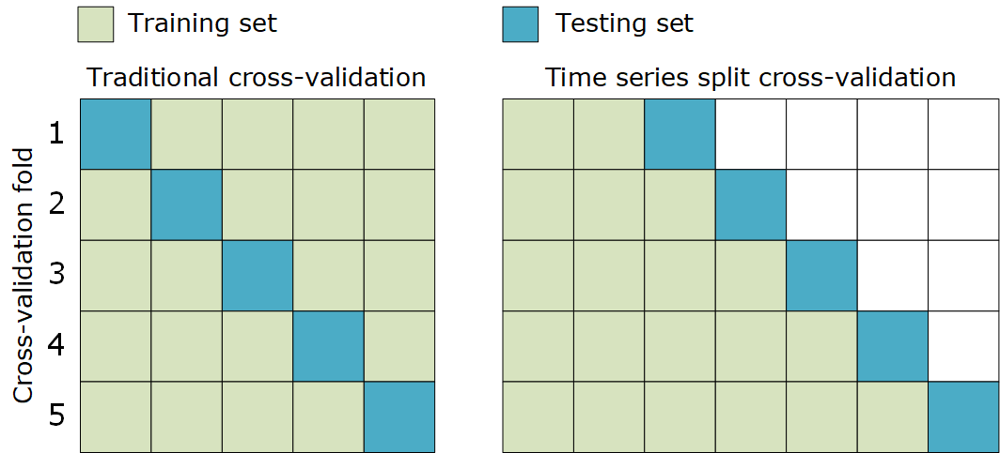

   **Figure 2:** Illustration of
   traditional cross-validation and time series split cross-validation,
   both five-folds. In time series split, shown on the right, the order of
   data is taken into account.

Prior to cross-validation, the features are normalised [24]_ to a scale
of 0 to 1. This is important as the features used in classification have
vastly different scales. For example, the turbine data sheet gives
generator operating speeds of between 740 rpm and 1,300 rpm, while the
wind speeds recorded by the anemometers range from 0 m/s up to 34 m/s.
Normalisation preserves the characteristics and distribution of the
features and prevents potential problems that could arise due to
features with drastically different scales when classification is
done [25]_.

A number of performance metrics are available on scikit-learn to assess
classifier performance [26]_. Precision is the ratio of true positives,
\\(tp\) to the sum of \\(tp\) and false positives, \\(fp\), as shown in
Equation 1. Equation 2 describes recall, which is the ratio of \\(tp\)
to the sum of \\(tp\) and false negatives, \\(fn\) [27]_. The F1 score,
shown in Equation 3, is the harmonic average of precision and
recall [28]_. The reason for not using accuracy is because it does not
distinguish between \\(tp\) and true negatives, \\(tn\) [28]_  [29]_.
The metrics compute the scores for each class individually which are
averaged, taking into account the support, which is the number of data
points belonging to each class in the test set, to produce the final
weighted score. The higher the scores, the better the performance of the
classifier. \\(fp\) and \\(fn\) both have costs [28]_. However, it is
unknown at the moment which is more important for this wind farm.
Therefore, the optimisations will use the F1 score as the main
performance metric. As these metrics are not supported for multilabel
classification, the execution is performed in a loop for each label.
This means for each turbine, each cross-validation fold will output one
score for each label, producing 70 scores in total. These can then be
averaged for each turbine or fault to produce a final score.

.. math::

   \label{eq1}
     \textrm{precision} = \frac{tp}{tp + fp}

\ 

.. math::

   \label{eq2}
     \textrm{recall} = \frac{tp}{tp + fn}

.. math::

   \label{eq3}
     \textrm{F1~score} = 2 \times \frac{\textrm{precision} \times \textrm{recall}}{\textrm{precision} + \textrm{recall}}

The classification is carried out as a process. The first step is to use
cross-validation to optimise some initial hyperparameters of the
classifiers, namely criterion for DT and RF, and weights for kNN. The
criterion is either ``entropy`` or the default ``gini``, while weights
is either ``distance`` or the default ``uniform``. The classification is
done once using imbalanced data as it is, and once using balanced
training data. After evaluating whether balancing the data improves the
classifier’s performance, further hyperparameters can be tuned.

Results
-------

Overall results
~~~~~~~~~~~~~~~

Table 4 shows the overall results obtained when the criterion
hyperparameter is optimised for DT and RF, and the weights
hyperparameter is optimised for kNN through five-fold cross-validation,
using both imbalanced and balanced training data. The optimal
hyperparameter is the one that produces the highest average F1 score.
For each classification performed, the optimal hyperparameters were
found to be the non-default values. The mean and standard deviation were
obtained by averaging all scores output by all turbines for the optimal
hyperparameter. From these results, all three classifiers performed
better, with higher mean and lower standard deviation scores, when
trained on imbalanced datasets using the multilabel classification
approach compared to balanced datasets with separate estimators for each
label. The F1 scores for DT, RF and kNN is higher by 0.6 %, 0.5 % and
1.9 % respectively using imbalanced data compared to balanced data. The
best performance was by RF using imbalanced data, which had the highest
mean and lowest deviation scores. The kNN classifier meanwhile produced
the results with the lowest mean and highest deviations. An attempt was
made to further improve the performance of RF by optimising the number
of estimators hyperparameter, but this was not possible as the process
was found to exceed the available RAM. Hence, the only hyperparameter
considered for further tuning is the *k* value for kNN using imbalanced
dataset. The default value of *k* is 5 on scikit-learn, and values
between 1 and 200 were tested. Figure 3 shows the optimal *k* values
found for each turbine, which are the values that produce the highest
average F1 score. The optimal *k* is 13 or less for 17 turbines, and
more than 100 for 5 turbines. Based on the overall scores in Table 4,
the optimisation did increase the F1 score of kNN by 0.6 % compared to
using the imbalanced data without *k* optimisation, but compared to the
F1 scores of DT and RF using imbalanced data, this is still lower by 5.1
% and 6.1 % respectively.

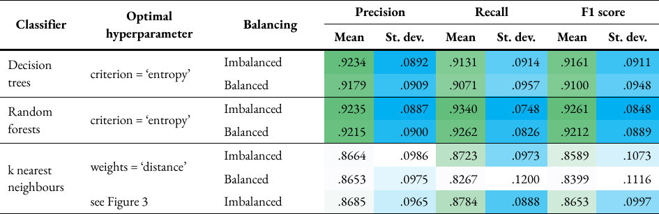

   **Table 4:** Overall precision, recall
   and F1 scores for optimising hyperparameters for decision trees and
   random forests, and k nearest neighbours. The mean and standard
   deviation are obtained by averaging all scores output by all turbines
   for the optimal hyperparameter. The values are colour-coded to show
   better performances (i.e. higher mean and lower standard deviation) in
   darker shades and worse performances in lighter shades.

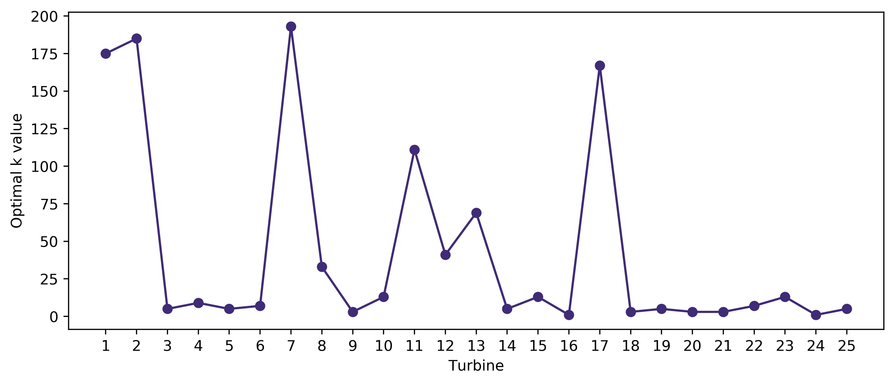

   **Figure 3:** Number of neighbours,
   or *k* value for each turbine optimised based on the average F1 score
   through five-fold cross-validation. The optimal *k* is 13 or less for 17
   turbines, and more than 100 for 5 turbines.

The time taken to execute the Python code using the optimal
hyperparameters to produce the results for all 25 turbines, which
includes reading the merged CSV file, processing and labelling samples,
classification using cross-validation, and calculation of performance
metrics, for each classifier is listed in Table 5. As other processes
running in the background at the time of execution and some runs were
interrupted due to computer crashes, the time taken could not be
measured accurately and these values are only approximate. Overall,
balancing the training data is shown to increase the training time,
which is expected as the size of training data will be larger and
separate estimators are used for each label compared to just one when
using imbalanced data. DT and RF only took 8 hours with imbalanced data.
Despite balancing the training data, DT and RF took only 18 hours
compared to kNN with imbalanced data, which took 20 hours. The
relatively long timings make kNN an inefficient classifier compared to
DT and RF. As a result, the following results will only focus on the
classifier with the best performance, which is RF. The other
classifiers, however, can be tested more efficiently if better computing
resources are available.

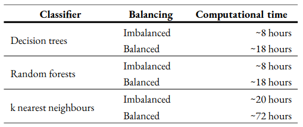

   **Table 5:** Time taken to run each
   classifier using imbalanced and balanced datasets for the 30-month
   period. These timings are approximate as the RAM was not utilised fully
   by the Python application due to other processes running in the
   background, and the application had to be restarted a number of time due
   to system crashes.

Performance of each turbine and label
~~~~~~~~~~~~~~~~~~~~~~~~~~~~~~~~~~~~~

The classification results using random forests for each turbine and
label in full can be found in Appendix 3. The scores of each performance
metric from cross-validation were grouped based on turbine or label
which were then averaged to produce the mean scores. Additionally, the
maximum and minimum values were also found. The turbine with the worst
performance is turbine 1, with a mean and minimum F1 scores of 87 % and
44 % respectively using imbalanced data, and 86 % and 41 % respectively
using balanced data, for turbine 1. Four other turbines had minimum
scores less than 70 %, namely turbines 7, 9, 15 and 16. Looking at the
labels, turbine category 10, which is ‘electrical system’ had the worst
performance, with mean and minimum F1 scores of 84 % and 44 %
respectively using imbalanced data, and 82 % and 41 % respectively using
balanced data. These minimum scores correspond to the scores for turbine
1. Therefore, it can be deduced that the classifier’s ability to predict
faults in the electrical system is relatively low. This is followed
closely by turbine category 11, ‘pitch control’, which has mean and
minimum F1 scores of 84 % and 57 % respectively using imbalanced data
and 83 % and 55 % respectively using balanced data. For all other
turbine categories, the minimum score did not drop below 75 %.

Figure 4 shows the various turbine categories quantified by downtime
frequency on the left and period on the right, both per turbine per
year. Looking at only turbine categories used as labels, ‘pitch control’
and ‘electrical system’ are the two categories causing the most downtime
events and are in the top three in terms of the downtime period. These
two labels also had the worst performance scores.

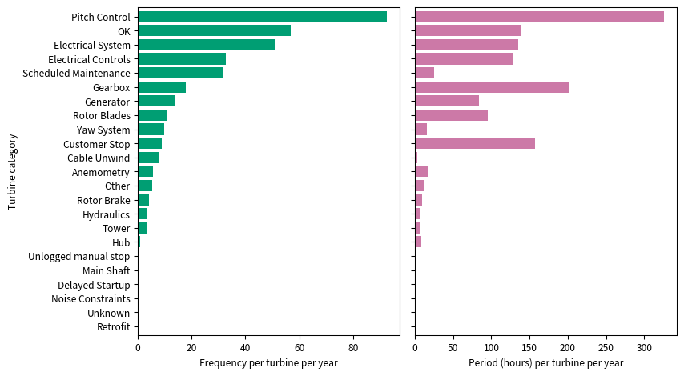

   **Figure 4:** Bar chart showing the
   various turbine categories quantified by the downtime frequency per
   turbine per year on the left, and downtime period, in hours, per turbine
   per year on the right. This was plot using the downtime data.

Performance of each class
~~~~~~~~~~~~~~~~~~~~~~~~~

Since turbine category 10 was found to have the worst performance, the
performance of each class for this label is looked at in more detail,
which is done by obtaining confusion matrices. A confusion matrix
displays, for each class, the number of samples predicted correctly and
what the wrongly predicted samples were classified as [26]_. This will
allow the decision to be made whether the number of classes and
intervals used for fault prediction can be tweaked for better classifier
performance. The matrices were first obtained for all turbines with only
this label using both imbalanced and balanced training data. Through
five-fold cross-validation, a total of 125 matrices were produced, which
were then combined and normalised, which will produce the classification
accuracy. The confusion matrices are shown in Appendix 4 and Appendix 5.
93-95 % of ‘normal’ and 73-75 % of ‘curtailment’ samples were classed
correctly. In comparison, only 21-24 % of ‘faulty’ samples were
classified correctly, with 47-48 % misclassified as ‘curtailment’ and
21-26 % misclassified as ‘normal’.

Due to this misclassification percentage being higher than the accuracy
of the ‘faulty’ class, the classification was repeated by dropping all
rows with ‘curtailment’, effectively removing the class. There is a
significant improvement in the accuracy of ‘faulty’ samples, from 21-24
% to 41-44 %. However, the majority of samples belonging to this class
(44-49 %) were still misclassified as ‘normal’. In fact, this is the
case for the ‘*X* hours before fault’ classes, with or without the use
of the ‘curtailment’ class. As *X* increases, the accuracy is seen to
decrease, and the percentage of misclassification as ‘normal’ increases.

To make a comparison, the same analysis was repeated for turbine
category 5, which is ‘gearbox’. This category was chosen as its mean F1
score was relatively high (92 % compared to 84 % for turbine category
10), it causes the second longest downtime period based on Figure 4, and
it indicates a problem in the mechanical system, rather than electrical.
96-97 % of ‘normal’ and 83 % of ‘curtailment’ samples were classed
correctly. In comparison, 43-44 % of ‘faulty’ samples were classified
correctly, with 16-21 % misclassified as ‘curtailment’ and 34-40 %
misclassified as ‘normal’. The performance was better compared to
turbine category 10, but the misclassification of the ‘faulty’ class as
‘normal’ is higher. Removing the ‘curtailment’ increased the accuracy of
‘faulty’ samples, from 43-44 % to 48-55 %. However, the
misclassification of this class as ‘normal’ was still high (41-48 %).

Using a balanced dataset overall decreased the misclassification rate of
‘*X* hours before fault’ classes as ‘normal’, but increased the
misclassification of the ‘faulty’ class as ‘normal’.

Feature importance
~~~~~~~~~~~~~~~~~~

The importance of each feature used, which are a set of normalised
scores [30]_, were also obtained similar to the confusion matrix. The
higher the feature importance, the more influence the feature had in
determining the class of the samples. The feature importance for turbine
categories 10 and 5 are shown in Table 6. For both turbine categories,
the wind speed and nacelle position were found to be the most important
features, and the maximum, average and deviations of the active power
were found to be the least important, regardless of training data
balancing. The wind direction was the third most important feature for
turbine category 10 regardless of balancing, and for turbine category 5
using imbalanced data. In the case of balanced data for turbine category
5, the third most important feature was the pitch angle.

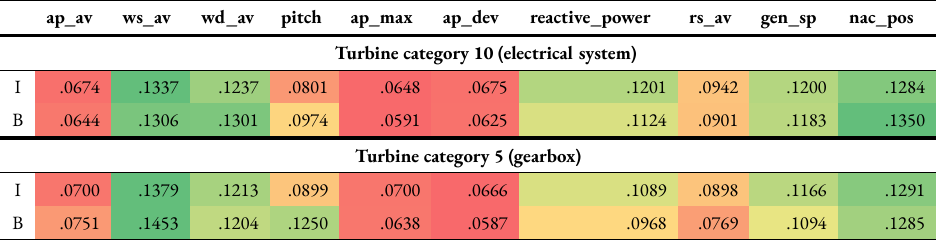

   **Table 6:** Feature importance for
   turbine categories 10 and 5 using random forests and either imbalanced
   (I) or balanced (B) training data. The values are normalised and
   colour-coded, transitioning from red (lower importance) to yellow
   (intermediate) to green (higher importance).

Discussion
----------

As mentioned earlier, kNN compares the test sample to *k* neighbouring
training samples to determine the class. This means all training samples
have to be stored in memory [31]_ which in turn could slow down the
computer, causing the classifier to take a longer time to produce
results. Being a non-parametric technique [17]_ unlike DT and RF, kNN is
prone to the curse of dimensionality [31]_, which happens when the
dimensions or number of features increases [32]_. This might explain the
lower performance metric scores in comparison. There are big differences
between the optimal *k* values for some turbines as shown in Figure 3,
which could be due to the data for each turbine having different
distributions and characteristics.

Overall, using a single multiclass-multilabel classifier with imbalanced
training data produced better scores, which could be due to presence of
correlations between the different turbine categories used as labels
that are generalised better using this approach [18]_.

As the labels ‘gearbox’ and ‘electrical system’ are in the top three out
of 14 labels used causing longest downtimes, they should have more
samples classed as ‘faulty’ and ‘*X* hours before fault’ compared to
other categories, which therefore should result in better performance as
the classifier would have learned the characteristics of different
samples belonging to the same classes. This was not the case, however,
looking at the confusion matrices in Appendix 4 and Appendix 5. The
classifier tends to misclassify ‘faulty’ and ‘*X* hours before fault’
classes as ‘normal’ at a higher rate than the accuracy for these
classes. This is still the case after removing the ‘curtailment’ class,
which saw an improvement in the accuracy of the ‘faulty’ class. The
accuracies of ‘*X* hours before fault’ classes could potentially be
increased by reducing the 6-hour intervals used and the maximum of 48
hours before a fault. The analysis should be repeated by reducing 48
hours to a smaller timescale, such as 12 hours, or by combining all
samples that fall under this with ‘faulty’ points to make the
classification binary. Although this is likely to improve the
performance, the classifier will not be able to give an indication of
the timescale before a potential fault, therefore making it more
difficult to decide on the appropriate action to be taken to avoid
catastrophic failure in the turbine.

Based on the feature importance in Table 6, active power SCADA fields
were least influential in predicting faults for both labels. The
labelled power curves for ‘electrical system’ in Figure 5 below shows no
clear relationship between fault points and the power curve shape. There
are also many overlapping ‘normal’, ‘faulty’ and ‘*X* hours before
fault’ points even after filtration of curtailment and anomalies, which
could explain why this feature was less important.

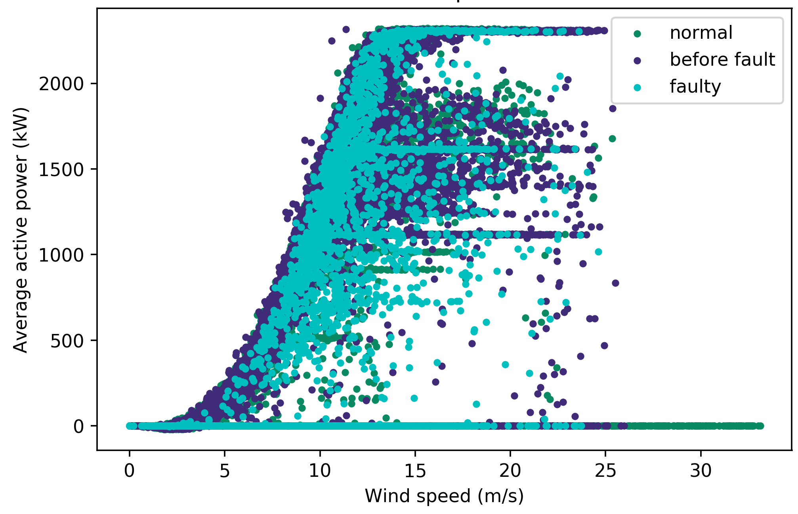

   **Figure 5**: Labelled power curve
   for turbine 1 with turbine category 10 (‘electrical system’) through the
   two stages of filtering out anomalous and curtailment points labelled as
   ‘normal’. The original power curve is shown in **Figure 5a**.

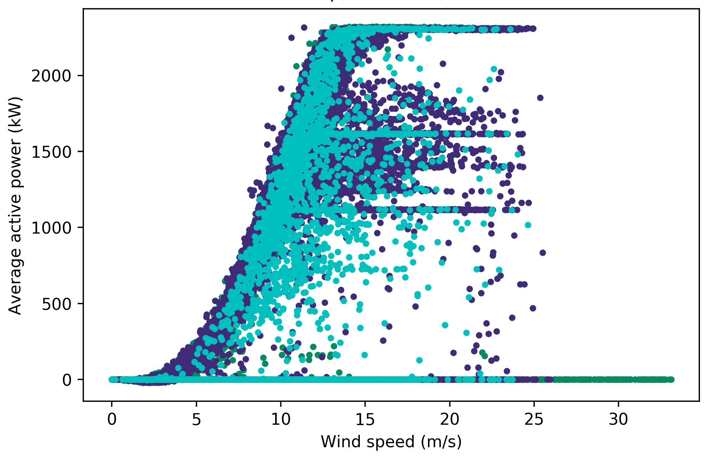

   The first
   stage involves a filter based on a pitch angle threshold, which produces
   **Figure 5b**.

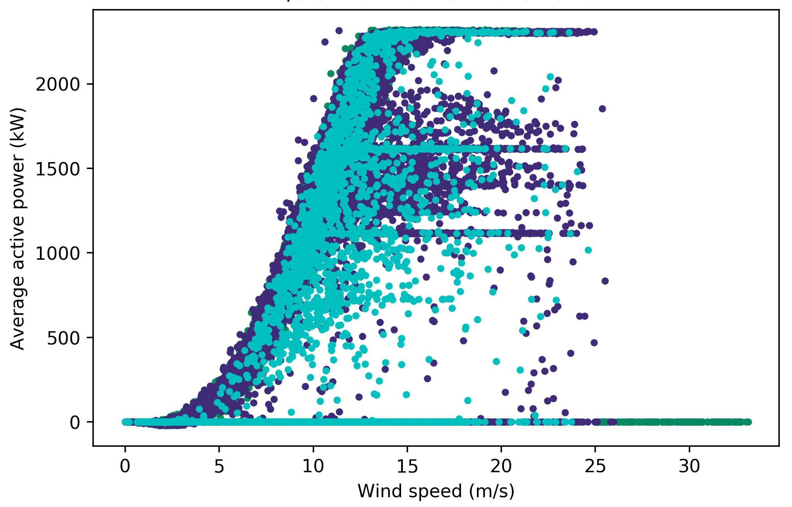

   The second stage involves several additional filters to
   produce the final power curve **Figure 5c**.

The reactive power and generator speed played a bigger role in the
classification for ‘electrical system’, which makes sense considering
the reactive power is produced as a result of impedance in the current
due to electromagnetic fields produced by generators and
transformers [33]_. It is likely that the features used in
classification for this label are unsuitable. A fault in the electrical
system would be reflected in voltages, currents, frequencies [34]_ and
temperature of power switchboards and cables. Electrical system faults
could also be caused by environmental conditions such as lightning
strikes and contact of wires with wildlife [34]_. If there are such
conditions recorded as environmental downtime categories, these should
be accounted for when analysing faults in the electrical system.

The ‘gearbox’ label was also found to perform poorly for these classes,
despite having a higher mean F1 score than ‘electrical faults’, which
could be due to feature selection as well. Statistics from the National
Renewable Energy Laboratory’s gearbox failure database indicate that
most faults are caused by bearings, gears and other components including
filtration and lubrication systems [35]_. These are mostly due to wear,
fatigue and cracks [36]_ and may be detected with higher accuracy if the
features include quantities such as torque, oil pressure and gearbox
temperature.

The SCADA data provided for this project only had 17 SCADA fields, of
which 10 are used as features. This did not include voltages, currents,
frequencies, torques or temperature readings, but the SCADA system for
the turbine model used does measure these parameters. When a more
complete SCADA data is available, the evaluation should be done by
increasing the number of features to include these fields. The role of
environmental conditions on failures could explain why wind speed and
direction were very influential in detecting faults in the two labels
analysed, although further in-depth analysis is required to verify this.

Balancing the training dataset improved the classification accuracy of
‘*X* hours before fault’ classes slightly. An overall improved model may
be developed by oversampling only these classes for training, but there
is a trade-off between this and the training time and computational
resources required.

The dataset could have incorrect readings in the SCADA fields caused by
broken or unresponsive sensors which are not detected as unusual when
the downtime data is used in labelling. This was why a power threshold
before cut-in speed was applied to remove redundant data points, by
visually inspecting the power curve of the turbine as seen in Figure 1.
The dataset should be manually inspected for all other features using
curves such as pitch versus power and power versus rotor speed, to see
if there are any other incorrect values previously undetected which may
affect the classifier’s accuracy in detecting faults. The rows of data
corresponding to these values should then be excluded from the training
data.

Future work
~~~~~~~~~~~

In addition to possible areas for future work discussed above, the
following were identified.

When more data is available, the analysis should be repeated using
historic datasets spanning the life of the turbine. Historic data would
have recorded the different states a turbine has experienced over its
life, and therefore when a classifier is trained on this, it could
detect future turbine states easier. However, this will mean the
training data will be bigger, which in turn causes longer training time
and more computing resources to be used. Another area of work is to test
the performance of a classifier using different lengths of datasets for
training while keeping the testing set and hyperparameter settings
constant. This will allow for the most appropriate length of dataset for
training to be determined based on the resources available to produce
satisfactory results in terms of training time and classification
accuracy.

After a classifier has been trained and used in practice, its
performance over time should be monitored. If the performance is found
to diminish over time or after a major component replacement, the
classifier should be retrained using recent data. As the classification
makes a distinction between the different faults, the ability to alert
relevant maintenance professionals for a specific fault automatically is
possible.

Instead of using turbine categories in the downtime data, which is
supervised, for labelling, the alarm logs, which are unsupervised, can
instead be used to compare the results. The number of alarm logs for the
turbines used, however, is 480, compared to 23 turbine categories. This
will mean the number of labels will be much higher, which will cause
longer computational time. A solution to reduce this is to group similar
alarms into one class. Another approach would be to use a single label
with each alarm as a separate class, but there is likely to be overlap
between classes when fault prediction is also included. If actual
failure records are available, a comparison can be made between the
predicted classes, actual classes, and actual failures that have
occurred and their costs.

Further optimisation of hyperparameters is possible, such as finding the
optimal number of estimators for RF. Each optimisation takes time and is
limited by the specifications of the computer used, which is why this
was not carried out in this project. Detailed analysis done on the
results using RF for two labels above should be repeated for each label
and classifier used for fair comparisons to be made.

The methodology could also be tested for wind turbines of different
models in different sites. Provided these turbines have similar SCADA
data with downtime records, only slight modifications to the codes, such
as the data source, field names, and number of features, would be
required in order to be used on other turbine models.

In industry, a cost function analysis needs to be done prior to
implementing this fault detection method. It is defined as the cost of a
false alarm (false positive) or failing to detect a fault in advance
(false negative). False positives and false negatives both incur
charges. The first is due to transporting labour and equipment to site,
which could be expensive especially for sites in harsh environments,
such as offshore wind farms. The second would cause unscheduled
downtime, the loss of revenue due to no power generation and replacement
of turbine components due to irreversible damage. This cost should then
be compared to the cost of alternatively using a condition monitoring
system, and the overall cost of running the wind farm or wind turbine.
The analysis should give an indication on which performance metric is
more important; if the cost of false negatives is more, attention should
be paid to the recall score, while the precision is more important if
false positives cost more [27]_.

Conclusion
----------

A methodology for predicting multiple wind turbine faults in advance by
implementing classification algorithms on wind turbine SCADA signals was
proposed. 30 months’ worth of SCADA data for a wind farm with 25
turbines was processed and labelled using corresponding downtime data
containing turbine categories that describe the condition of the
turbine. Since the multiple faults are treated as separate labels,
multiclass-multilabel classification algorithms, namely DT, RF and kNN,
offered in scikit-learn, the machine learning library for Python, were
analysed. In order to predict faults in advance, three types of classes
were used: ‘normal’ to indicate normal behaviour, ‘faulty’ to indicate a
fault, and ‘*X* hours before fault’ (where *X* = 6, 12, …, 48) to detect
faults in advance at varying time scales. This will allow predictive
maintenance to be done appropriate to the time scale to prevent
catastrophic failure to the turbine. Each of these classifiers have
hyperparameters which were tuned for optimal performance on the data
using five-fold cross-validation. The effects of balancing training data
were also investigated.

The use of multilabel-multiclass algorithms allowed for the
classification of each turbine to be done using a single estimator which
produces the results of all labels simultaneously and has a shorter
training time. Of the three classifiers, RF was found to have the best
performance overall. A detailed analysis was done on the results for two
labels, namely ‘electrical system’, which had the worst performance, and
‘gearbox’ which had relatively better performance. The performance of
the ‘*X* hours before fault’ classes was found to be relatively poor
compared to the other two classes. The performance of these classes was
slightly better using balanced training data. This has drawbacks,
including using separate estimators for each label, and increased
training time and use of resources due to the use of larger training
data. After evaluating feature importance, it was concluded that the
poor performance of these classes could be attributed to the features
used or errors in the data. Further work should be done using additional
SCADA fields relevant to each label to verify this. After additional
improvements to the model and conducting a cost function analysis, the
method could be tested in industry.

Acknowledgements
----------------

I would like to thank my academic supervisor, Dr Nick Bennett, Assistant
Professor at Heriot-Watt University, and my industrial supervisor, Dr
Iain Dinwoodie, Senior Asset Performance Engineer at Natural Power, for
their endless guidance and feedback, and making this project possible.
Special thanks to the Technical team of Natural Power for giving me the
opportunity to work on this project with them. Thanks to everyone else
at Natural Power’s Stirling office and my course mates, Raphaela Hein
and Inés Ontillera, for making this placement an enjoyable experience.
Last but not least, a big thank you to my parents for supporting me
throughout my studies.

Appendix
--------

A1: Pitch angle threshold
~~~~~~~~~~~~~~~~~~~~~~~~~

{% include gallery id=“gfa1” layout=“half” caption=“**Figure A1**: Power
curves for turbine 1 used in selecting the pitch angle threshold.
**Figure A1a** is the original power curve. In **Figure A1b**, data
points with a pitch angle not equal to 0 ° between 90 % and 10 % power
were filtered out, which distorts the power curve shape. In **Figure
A1c**, all data points have a pitch angle between 0 ° and 3.5 °, which
removes most curtailment and anomalous points while maintaining the
typical power curve shape. In **Figure A1d**, all data points have a
pitch angle between 0 ° and 7 °, which allows some curtailment points to
appear. Therefore, it was decided that the filter used in Figure A1c is
the most suitable.” %}

A2: Power before cut-in threshold
~~~~~~~~~~~~~~~~~~~~~~~~~~~~~~~~~

{% include gallery id=“gfa2” caption=“**Figure A2**: Power curves for
turbine 24 used in selecting the power threshold before cut-in speed.
**Figure A2a** is the original power curve. **Figure A2b** is the power
curve with a filter applied to remove all data points with power > 0 kW
before the cut-in speed of 3 m/s. Anemometer wind speeds, which were
used to plot these power curves, are not an accurate measure of the wind
speed incident on the turbine blades. Therefore, a threshold of 100 kW
before cut-in is applied, which maintains the power curve shape for all
25 turbines while removing anomalous points, such as the ones in turbine
2’s power curve.” %}

A3: Results for random forest classifier
~~~~~~~~~~~~~~~~~~~~~~~~~~~~~~~~~~~~~~~~

 

A4: Confusion matrices - electrical system
~~~~~~~~~~~~~~~~~~~~~~~~~~~~~~~~~~~~~~~~~~

 

A5: Confusion matrices - gearbox
~~~~~~~~~~~~~~~~~~~~~~~~~~~~~~~~

 

References
----------

.. [1]
   Kim, K., Parthasarathy, G., Uluyol, O., Foslien, W., Sheng, S. &
   Fleming, P. (2012). `Use of SCADA Data for Failure Detection in Wind
   Turbines <https://doi.org/10.1115/ES2011-54243>`__. 2071-2079.

.. [2]
   Leahy, K., Hu, R. L., Konstantakopoulos, I. C., Spanos, C. J. &
   Agogino, A. M. (2016). `Diagnosing wind turbine faults using machine
   learning techniques applied to operational
   data <https://doi.org/10.1109/ICPHM.2016.7542860>`__. 2016 IEEE
   International Conference on Prognostics and Health Management
   (ICPHM), 1-8.

.. [3]
   Kim, K., Parthasarathy, G., Uluyol, O., Foslien, W., Sheng, S. &
   Fleming, P. (2012). `Use of SCADA Data for Failure Detection in Wind
   Turbines <https://doi.org/10.1115/ES2011-54243>`__. 2071-2079.

.. [4]
   Kim, K., Parthasarathy, G., Uluyol, O., Foslien, W., Sheng, S. &
   Fleming, P. (2012). `Use of SCADA Data for Failure Detection in Wind
   Turbines <https://doi.org/10.1115/ES2011-54243>`__. 2071-2079.

.. [5]
   Dienst, S. & Beseler, J. (2016). `Automatic Anomaly Detection in
   Offshore Wind SCADA
   Data <https://windeurope.org/summit2016/conference/submit-an-abstract/pdf/626738292593.pdf>`__.

.. [6]
   Dienst, S. & Beseler, J. (2016). `Automatic Anomaly Detection in
   Offshore Wind SCADA
   Data <https://windeurope.org/summit2016/conference/submit-an-abstract/pdf/626738292593.pdf>`__.

.. [7]
   Tautz-Weinert, J. & Watson, S. J. (2017). `Using SCADA data for wind
   turbine condition monitoring - a
   review <https://doi.org/10.1049/iet-rpg.2016.0248>`__. IET Renewable
   Power Generation, 11(4), 382-394.

.. [8]
   Leahy, K., Hu, R. L., Konstantakopoulos, I. C., Spanos, C. J. &
   Agogino, A. M. (2016). `Diagnosing wind turbine faults using machine
   learning techniques applied to operational
   data <https://doi.org/10.1109/ICPHM.2016.7542860>`__. 2016 IEEE
   International Conference on Prognostics and Health Management
   (ICPHM), 1-8.

.. [9]
   Wind Turbine Condition Monitoring. (2015). [White Paper]. National
   Instruments.

.. [10]
   Kim, K., Parthasarathy, G., Uluyol, O., Foslien, W., Sheng, S. &
   Fleming, P. (2012). `Use of SCADA Data for Failure Detection in Wind
   Turbines <https://doi.org/10.1115/ES2011-54243>`__. 2071-2079.

.. [11]
   Wind Turbine Condition Monitoring. (2015). [White Paper]. National
   Instruments.

.. [12]
   García Márquez, F. P., Tobias, A. M., Pinar Pérez, J. M. & Papaelias,
   M. (2012). `Condition monitoring of wind turbines: Techniques and
   methods <https://doi.org/10.1016/j.renene.2012.03.003>`__. Renewable
   Energy, 46, 169-178.

.. [13]
   Godwin, J. L. & Matthews, P. (2013). Classification and Detection of
   Wind Turbine Pitch Faults Through SCADA Data Analysis. International
   Journal of Prognostics and Health Management, 4.

.. [14]
   Leahy, K., Hu, R. L., Konstantakopoulos, I. C., Spanos, C. J. &
   Agogino, A. M. (2016). `Diagnosing wind turbine faults using machine
   learning techniques applied to operational
   data <https://doi.org/10.1109/ICPHM.2016.7542860>`__. 2016 IEEE
   International Conference on Prognostics and Health Management
   (ICPHM), 1-8.

.. [15]
   García Márquez, F. P., Tobias, A. M., Pinar Pérez, J. M. & Papaelias,
   M. (2012). `Condition monitoring of wind turbines: Techniques and
   methods <https://doi.org/10.1016/j.renene.2012.03.003>`__. Renewable
   Energy, 46, 169-178.

.. [16]
   Tautz-Weinert, J. & Watson, S. J. (2017). `Using SCADA data for wind
   turbine condition monitoring - a
   review <https://doi.org/10.1049/iet-rpg.2016.0248>`__. IET Renewable
   Power Generation, 11(4), 382-394.

.. [17]
   Leahy, K., Hu, R. L., Konstantakopoulos, I. C., Spanos, C. J. &
   Agogino, A. M. (2016). `Diagnosing wind turbine faults using machine
   learning techniques applied to operational
   data <https://doi.org/10.1109/ICPHM.2016.7542860>`__. 2016 IEEE
   International Conference on Prognostics and Health Management
   (ICPHM), 1-8.

.. [18]
   Tautz-Weinert, J. & Watson, S. J. (2017). `Using SCADA data for wind
   turbine condition monitoring - a
   review <https://doi.org/10.1049/iet-rpg.2016.0248>`__. IET Renewable
   Power Generation, 11(4), 382-394.

.. [19]
   Tautz-Weinert, J. & Watson, S. J. (2017). `Using SCADA data for wind
   turbine condition monitoring - a
   review <https://doi.org/10.1049/iet-rpg.2016.0248>`__. IET Renewable
   Power Generation, 11(4), 382-394.

.. [20]
   Yang, W., Tavner, P. J., Crabtree, C. J., Feng, Y. & Qiu, Y. (2014).
   `Wind turbine condition monitoring: Technical and commercial
   challenges <https://doi.org/10.1002/we.1508>`__. Wind Energy, 17(5),
   673-693.

.. [21]
   Leahy, K., Hu, R. L., Konstantakopoulos, I. C., Spanos, C. J. &
   Agogino, A. M. (2016). `Diagnosing wind turbine faults using machine
   learning techniques applied to operational
   data <https://doi.org/10.1109/ICPHM.2016.7542860>`__. 2016 IEEE
   International Conference on Prognostics and Health Management
   (ICPHM), 1-8.

.. [22]
   Gill, S., Stephen, B. & Galloway, S. (2012). `Wind turbine condition
   assessment through power curve copula
   modeling <https://doi.org/10.1109/TSTE.2011.2167164>`__. IEEE
   Transactions on Sustainable Energy, 3, 94-101.

.. [23]
   Kusiak, A. & Li, W. (2011). `The prediction and diagnosis of wind
   turbine faults <https://doi.org/10.1016/j.renene.2010.05.014>`__.
   Renewable Energy, 36(1), 16-23.

.. [24]
   Godwin, J. L. & Matthews, P. (2013). Classification and Detection of
   Wind Turbine Pitch Faults Through SCADA Data Analysis. International
   Journal of Prognostics and Health Management, 4.

.. [25]
   Kusiak, A. & Li, W. (2011). `The prediction and diagnosis of wind
   turbine faults <https://doi.org/10.1016/j.renene.2010.05.014>`__.
   Renewable Energy, 36(1), 16-23.

.. [26]
   Leahy, K., Hu, R. L., Konstantakopoulos, I. C., Spanos, C. J. &
   Agogino, A. M. (2016). `Diagnosing wind turbine faults using machine
   learning techniques applied to operational
   data <https://doi.org/10.1109/ICPHM.2016.7542860>`__. 2016 IEEE
   International Conference on Prognostics and Health Management
   (ICPHM), 1-8.

.. [27]
   `Welcome to Python.org <https://www.python.org/>`__. (n.d.).

.. [28]
   Pedregosa, F., Varoquaux, G., Gramfort, A., Michel, V., Thirion, B.,
   Grisel, O., Blondel, M., Prettenhofer, P., Weiss, R., Dubourg, V.,
   Vanderplas, J., Passos, A., Cournapeau, D., Brucher, M. & Perrot, M.
   (2011). `Scikit-learn: Machine Learning in
   Python <https://jmlr.org/papers/volume12/pedregosa11a/pedregosa11a.pdf>`__.
   Journal of Machine Learning Research, 12, 2825-2830.

.. [29]
   `1.12. Multiclass and multilabel algorithms - Scikit-learn 0.18.2
   documentation <https://scikit-learn.org/0.18/modules/multiclass.html>`__.
   (n.d.).

.. [30]
   `Decision Tree
   Classifier <http://mines.humanoriented.com/classes/2010/fall/csci568/portfolio_exports/lguo/decisionTree.html>`__.
   (2010).

.. [31]
   `Random forests - Classification
   description <https://www.stat.berkeley.edu/~breiman/RandomForests/cc_home.htm>`__.
   (n.d.).

.. [32]
   Sutton, O. (2012). `Introduction to k Nearest Neighbour
   Classification and Condensed Nearest Neighbour Data
   Reduction <http://www.math.le.ac.uk/people/ag153/homepage/KNN/OliverKNN_Talk.pdf>`__.

.. [33]
   `1.6. Nearest Neighbors - Scikit-learn 0.19.0
   documentation <https://scikit-learn.org/0.19/modules/neighbors.html>`__.
   (n.d.).

.. [34]
   `1.10. Decision Trees - Scikit-learn 0.18.2
   documentation <https://scikit-learn.org/0.18/modules/tree.html>`__.
   (n.d.).

.. [35]
   Lemaitre, G., Nogueira, F., Oliveira, D. & Aridas, C. (n.d.).
   `Welcome to imbalanced-learn
   documentation! <https://imbalanced-learn.org/stable/>`__.

.. [36]
   `6.4. Introduction to Time Series
   Analysis <https://www.itl.nist.gov/div898/handbook/pmc/section4/pmc4.htm>`__.
   (n.d.).

.. [37]
   `3.1. Cross-validation: Evaluating estimator performance -
   Scikit-learn 0.18.2
   documentation <https://scikit-learn.org/0.18/modules/cross_validation.html>`__.
   (n.d.).

.. [38]
   Puget, J. F. (2016, July 5). Overfitting In Machine Learning - IT
   Best Kept Secret Is Optimization - CT904.

.. [39]
   Liang, Y. (2016). `Machine Learning Basics - Lecture 6:
   Overfitting <https://www.cs.princeton.edu/courses/archive/spring16/cos495/slides/ML_basics_lecture6_overfitting.pdf>`__.

.. [40]
   `Normalize Data - ML Studio (classic) -
   Azure <https://docs.microsoft.com/en-us/azure/machine-learning/studio-module-reference/normalize-data>`__.
   (2017, June 2).

.. [41]
   `4.3. Preprocessing data - Scikit-learn 0.19.0
   documentation <https://scikit-learn.org/0.19/modules/preprocessing.html>`__.
   (n.d.).

.. [42]
   `3.3. Model evaluation: Quantifying the quality of
   predictions-Scikit-learn 0.19.2
   documentation <https://scikit-learn.org/0.19/modules/model_evaluation.html>`__.
   (n.d.).

.. [43]
   de Ruiter, A. (2015, February 9). Performance measures in Azure ML:
   Accuracy, Precision, Recall and F1 Score.

.. [44]
   `Performance Measures for Machine
   Learning <https://www.cs.cornell.edu/courses/cs578/2003fa/performance_measures.pdf>`__.
   (n.d.).

.. [45]
   `Performance Measures for Machine
   Learning <https://www.cs.cornell.edu/courses/cs578/2003fa/performance_measures.pdf>`__.
   (n.d.).

.. [46]
   SAS Help Center: Precision, Recall, and the F1 Score.

.. [47]
   `Performance Measures for Machine
   Learning <https://www.cs.cornell.edu/courses/cs578/2003fa/performance_measures.pdf>`__.
   (n.d.).

.. [48]
   `3.3. Model evaluation: Quantifying the quality of
   predictions-Scikit-learn 0.19.2
   documentation <https://scikit-learn.org/0.19/modules/model_evaluation.html>`__.
   (n.d.).

.. [49]
   Rudy, J. (2013). `Plotting feature importance - Py-earth 0.1.0
   documentation <https://contrib.scikit-learn.org/py-earth/auto_examples/plot_feature_importance.html>`__.

.. [50]
   Gutierrez-Osuna, R. (n.d.). L8: Nearest neighbors - CSCE 666 Pattern
   Analysis. CSE@TAMU.

.. [51]
   `1.6. Nearest Neighbors - Scikit-learn 0.19.0
   documentation <https://scikit-learn.org/0.19/modules/neighbors.html>`__.
   (n.d.).

.. [52]
   Gutierrez-Osuna, R. (n.d.). L8: Nearest neighbors - CSCE 666 Pattern
   Analysis. CSE@TAMU.

.. [53]
   Maitra, R. (n.d.). Distribution-free Predictive Approaches.

.. [54]
   `1.10. Decision Trees - Scikit-learn 0.18.2
   documentation <https://scikit-learn.org/0.18/modules/tree.html>`__.
   (n.d.).

.. [55]
   Reactive power - npower Business. (n.d.).

.. [56]
   Overbye, T. & Baldick, R. (n.d.). `EE369 POWER SYSTEM ANALYSIS -
   Lecture 18: Fault
   Analysis <https://users.ece.utexas.edu/~baldick/classes/369/Lecture_18.ppt>`__.

.. [57]
   Overbye, T. & Baldick, R. (n.d.). `EE369 POWER SYSTEM ANALYSIS -
   Lecture 18: Fault
   Analysis <https://users.ece.utexas.edu/~baldick/classes/369/Lecture_18.ppt>`__.

.. [58]
   `Statistics Show Bearing Problems Cause the Majority of Wind Turbine
   Gearbox
   Failures <https://www.energy.gov/eere/wind/articles/statistics-show-bearing-problems-cause-majority-wind-turbine-gearbox-failures>`__.
   (2015, September 17). Energy.gov.

.. [59]
   Sheng, S., McDade, M. & Errichello, R. (2011, October). `Wind Turbine
   Gearbox Failure Modes - A
   Brief <https://www.nrel.gov/docs/fy12osti/53084.pdf>`__. ASME/STLE
   2011 International Joint Tribology Conference, Los Angeles, CA, USA.

.. [60]
   de Ruiter, A. (2015, February 9). Performance measures in Azure ML:
   Accuracy, Precision, Recall and F1 Score.
